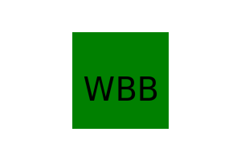
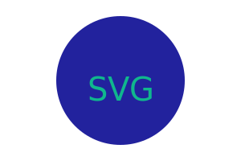
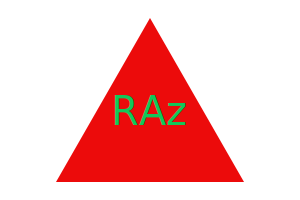

# CodeArt Logo

[](https://opensource.org/licenses/None)

 A node js command-line application that takes user input to generate a logo.

## Description
- A node js command-line application that takes user input to generate a logo.
- I want to generate a simple logo for my projects.
- As a junior web developer, I hoped to create a simple application using node js to create a simple logo and save it as a SVG file.
- This application helps save time and money when creating simple logos.


## Table of Contents
- [Installation](#installation)
- [Usage](#usage)
- [License](#license)
- [Contributing](#contributing)
- [Deployment](#deployment)
- [Questions](#questions)

## Installation
When first starting up the application, you can first start the application typing ```npm install``` and then ```npm start```. 

## Usage
  

After using the ```npm start``` command, you will be prompted different questions to generate your logo. 

## License

This project is licensed under the [None](https://opensource.org/licenses/None) License - see the [LICENSE](LICENSE) file for details.

## Feature(s)
- you can enter up to three characters as text for the logo 
- for the text color and shape color, you can enter a color keyword or a hexdecimal number 
- A SVG file is then created name "logo.svg" 

## Credits
- [SVG Extension](https://marketplace.visualstudio.com/items?itemName=jock.svg) 
- [MDN Web Docs - SVG Tutorial](https://developer.mozilla.org/en-US/docs/Web/SVG/Tutorial) 
- [npm js - jest](https://www.npmjs.com/package/jest?activeTab=readme) 
- [npm js - inquirer](https://www.npmjs.com/package/inquirer/v/8.2.4)

## Deployment
- [GitHub Repository](https://github.com/Develepor-Dan/CodeArt-Logo)
- [Walkthrough Video](https://www.youtube.com/watch?v=fPjUnNh__zE)

## Questions
For questions about contribution or about the project, please contact [Daniel Zavala](mailto:zavaladaniel151@gmail.com).